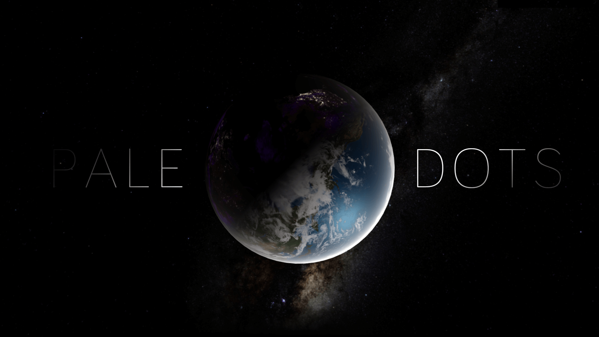

## Getting Started

### Prerequisites
- Node.js (make sure it is installed on your system)

### Setup & Run (Development)

Follow these steps in your terminal:

```sh
# 1. Clone the repository (or download and unzip it)
git clone <repository-url>
cd Solarsystem-3D

# 2. Install dependencies 
# npm install

# 3. Start the development server
node run.js
```

Now open your browser and go to:
```
http://localhost:8080
```

That's it! The 3D Solar System simulation should now be running locally.


# 3D Solar System

An interactive 3D simulation of our solar system built with three.js



## About This Project

> If you look at it, you see a dot. That‘s here. That’s home. That‘s us. On it, everyone you ever heard of,  every human being who ever lived, lived out their lives. The aggregate of all our joys and sufferings, … every saint and sinner in the history of our species, lived there on a mote of dust, suspended in a sunbeam.

## Features

- Smoothly switching between cameras
- First-person roaming and collision checking
- Photo-realistic rendering for a few solar system bodies
- A simple yet beautiful atmospheric model
- etc...

## Celestial Bodies


 ## Rendering Effect

 

 

 

## Atmospheric Scattering

 

 

---


